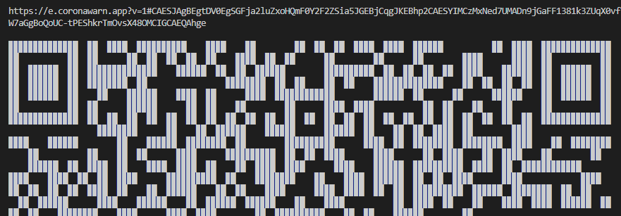

# CwaQRCodeExample
PlatformIO example for creating event registration codes for the Corona-Warn-App:

https://github.com/corona-warn-app/cwa-documentation/blob/master/event_registration.md

## Dependencies
* ricmoo/QRCode @ ^0.0.1
* https://github.com/Marc56K/PioProtocolBuffers.git
* https://github.com/Marc56K/CwaQRCodePayload.git

## Example
```cpp
#include <Arduino.h>
#include <iostream>
#include <string>
#include <vector>
#include "CwaQRCode.h"
#include "qrcode.h"

using namespace std;

bool printQrCode(QRCodePayload &payload)
{
    vector<uint8_t> buffer(payload.ByteSizeLong());
    if (payload.SerializeToArray(buffer.data(), buffer.size()))
    {
        const string url = string(cwa::urlPrefix) + base64url::encode((char *)buffer.data(), buffer.size());
        Serial.println(url.c_str());

        Serial.println();

        QRCode qrcode;
        uint8_t qrcodeData[qrcode_getBufferSize(11)];
        qrcode_initText(&qrcode, qrcodeData, 11, ECC_LOW, url.c_str());
        for (uint8_t y = 0; y < qrcode.size; y++)
        {
            for (uint8_t x = 0; x < qrcode.size; x++)
            {
                if (qrcode_getModule(&qrcode, x, y))
                {
                    Serial.print("██");
                }
                else
                {
                    Serial.print("  ");
                }
            }
            Serial.println();
        }
        return true;
    }

    return false;
}

void setup()
{
    Serial.begin(115200);

    GOOGLE_PROTOBUF_VERIFY_VERSION;

    QRCodePayload payload;
    payload.set_version(1);

    TraceLocation &locationData = *payload.mutable_locationdata();
    locationData.set_version(1);
    locationData.set_description("CWA Hacking");
    locationData.set_address("Batcave");
    locationData.set_starttimestamp(1619292698ull);
    locationData.set_endtimestamp(1619292698ull + 3600ull);

    CrowdNotifierData &crowdNotifierData = *payload.mutable_crowdnotifierdata();
    crowdNotifierData.set_version(1);
    crowdNotifierData.set_publickey(cwa::publicKey, sizeof(cwa::publicKey));
    vector<uint8_t> seed(16);
    for (int i = 0; i < seed.size(); ++i)
    {
        seed[i] = esp_random() % 256;
    }
    crowdNotifierData.set_cryptographicseed(seed.data(), seed.size());

    CWALocationData countryData;
    countryData.set_version(1);
    countryData.set_type(LOCATION_TYPE_TEMPORARY_OTHER);
    countryData.set_defaultcheckinlengthinminutes(30);
    countryData.SerializeToString(payload.mutable_countrydata());

    printQrCode(payload);

    google::protobuf::ShutdownProtobufLibrary();
}

void loop()
{
}
```
### Output

